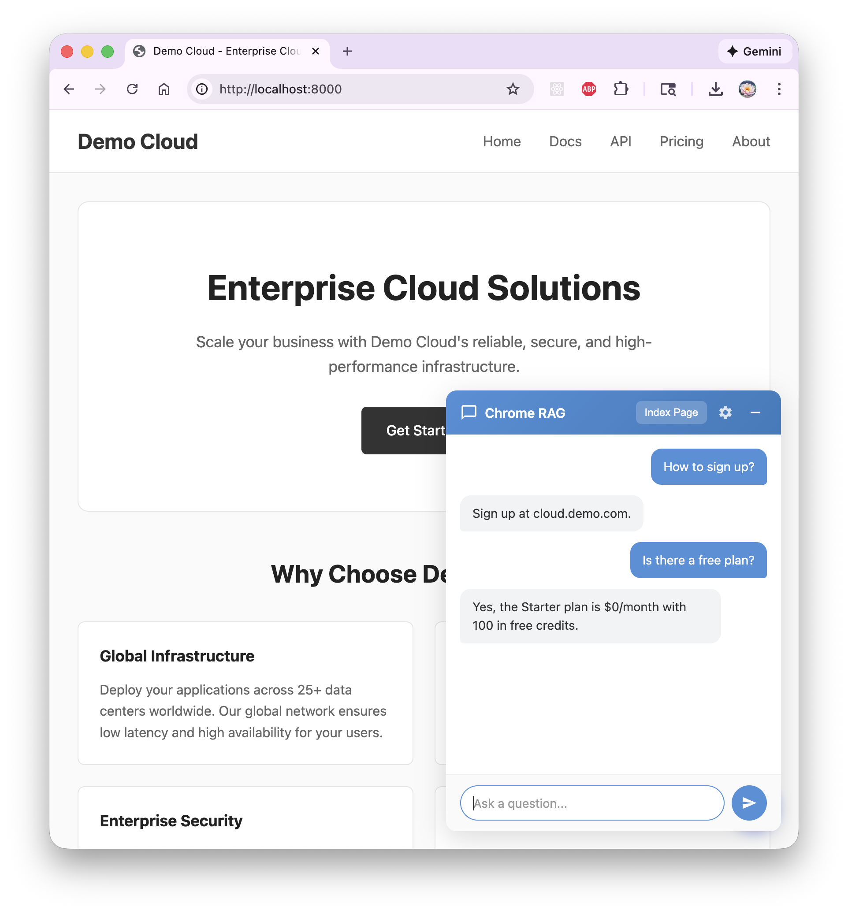

Note: this repo is a proof of concept. Further development is required to be production worthy.

# RAG as a Service

[](https://github.com/knoguchi/rag/actions/workflows/ci.yml)

Add an AI chat widget to any website. Multi-tenant RAG (Retrieval-Augmented Generation) system with a Go backend and TypeScript client SDK.



## Features

**Backend**
- Multi-tenant with isolated vector collections, hashed API keys, and per-tenant config
- Hybrid retrieval: dense embeddings + BM25 sparse vectors fused with RRF (Qdrant)
- Conversation-aware query rewriting for multi-turn sessions
- Optional LLM reranking and contextual retrieval (per-tenant flags)
- Local LLM via Ollama or any OpenAI-compatible server (llama.cpp, vLLM)
- Semantic chunking that preserves code blocks and heading hierarchy
- Streaming responses, gRPC and REST APIs via grpc-gateway

**Client SDK**
- Drop-in chat widget for any website (JAMstack friendly)
- TypeScript API client for custom integrations
- Browser bundle for `<script>` tag usage
- Shadow DOM to avoid CSS conflicts with host pages

**Crawler**
- Playwright for JavaScript-rendered pages
- HTML-to-Markdown conversion via Turndown
- URL include/exclude patterns

## Architecture

See [docs/ARCHITECTURE.md](docs/ARCHITECTURE.md) for technical details.

## Prerequisites

```bash
# macOS
brew install go buf golang-migrate ollama node

# Start Ollama and pull models
ollama serve &
ollama pull nomic-embed-text
ollama pull llama3.2
```

## Demo

For a complete working demo with sample data:

```bash
cd demo-site
./setup.sh
```

This script will:
- Start infrastructure (PostgreSQL, Qdrant, Ollama)
- Build and run the RAG service
- Create the default tenant (`00000000-0000-0000-0000-000000000001`)
- Start the sample Demo Cloud documentation site
- Crawl and ingest all documentation

---

## Quick Start

### 1. Start Backend

```bash
# Start infrastructure (Postgres, Qdrant)
docker-compose -f deployments/docker-compose.dev.yml up -d

# Run migrations and start server
cd server
make migrate-up
make run
```

### 2. Build Client SDK

```bash
cd client-sdk
npm install
npm run build
```

### 3. Add Chat Widget to Your Site

```html
<script src="path/to/rag-sdk.browser.js"></script>
<script>
  new ChatWidget({
    apiKey: 'your-tenant-api-key',
    baseUrl: 'http://localhost:8080'
  });
</script>
```

### 4. Create a Tenant and Ingest Documents

1. **Create a tenant** via the admin API (requires `ADMIN_API_KEY` on the
   server). The response contains the tenant's API key — it is shown exactly
   once, so store it securely:
   ```bash
   curl -X POST http://localhost:8080/v1/tenants \
     -H "Content-Type: application/json" \
     -H "X-API-Key: $ADMIN_API_KEY" \
     -d '{"name": "My Tenant"}'
   # => {"tenant": {...}, "api_key": "rag_..."}
   ```

2. **Run the crawler** to ingest documents (authenticates with the tenant key):
   ```bash
   cd crawler
   npm install
   npx playwright install chromium

   node crawl.js \
     --api-key rag_YOUR_TENANT_KEY \
     --url https://your-docs-site.com \
     --max-pages 50
   ```

## API Endpoints

All endpoints require an `X-API-Key` header: the admin key for tenant
management, a tenant key for everything else. The tenant is derived from the
key — requests never carry a tenant ID.

| Endpoint | Method | Auth | Description |
|----------|--------|------|-------------|
| `/v1/tenants` | POST | admin | Create tenant (returns the API key, once) |
| `/v1/tenants/:id` | GET | self or admin | Get tenant (no key in response) |
| `/v1/documents/ingest` | POST | tenant | Ingest document |
| `/v1/documents/ingest-url` | POST | tenant | Ingest from URL |
| `/v1/query` | POST | tenant | Query (non-streaming) |
| `/v1/query/stream` | POST | tenant | Query (streaming) |
| `/v1/retrieve` | POST | tenant | Retrieval only, no generation |

## Development

```bash
# Backend (from server/)
make generate  # Regenerate proto
make build     # Build binary
make test      # Run tests
make run       # Run RAG service

# Client SDK (from client-sdk/)
npm run build  # Build ES module and browser bundle
npm run dev    # Watch mode (TypeScript only)
```

## Tech Stack

**Backend:** Go, PostgreSQL, Qdrant, Ollama, gRPC/REST

**Client SDK:** TypeScript, esbuild

## License

Apache 2.0 - See [LICENSE](LICENSE) for details.
