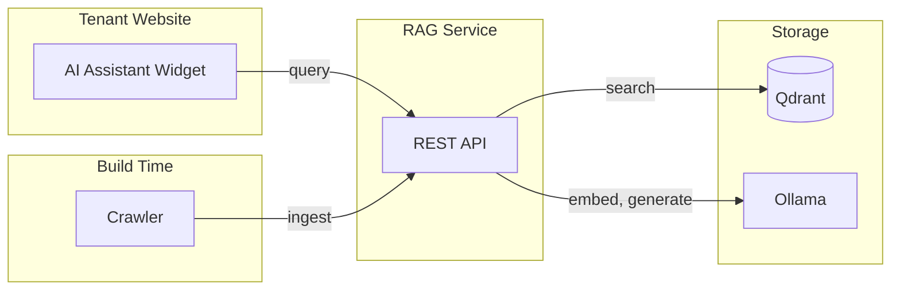
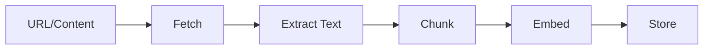
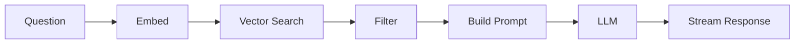
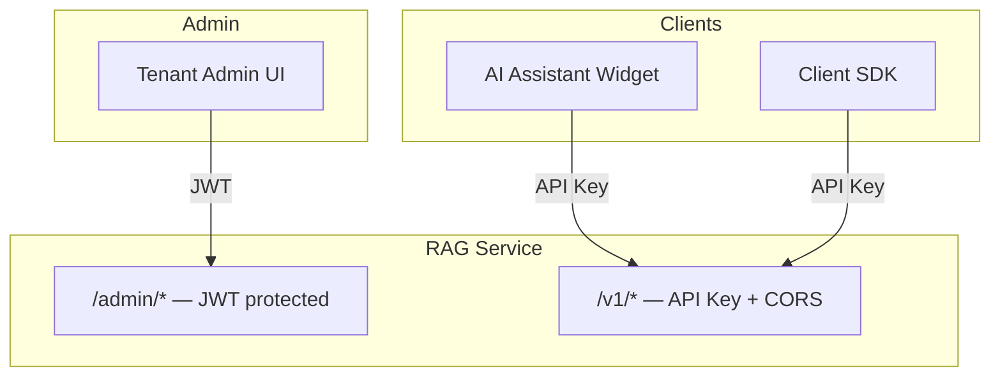

# Architecture

## Overview

Multi-tenant RAG (Retrieval-Augmented Generation) service. Each tenant gets isolated documents, vectors, and configuration—essentially their own AI assistant powered by their documentation.



PostgreSQL stores tenant config and document metadata (URLs, status) but isn't in the main data path.

**How it works:**
1. **Crawler** fetches your documentation site, converts HTML→Markdown, and ingests via REST API
2. **RAG Service** chunks the content, generates embeddings, and stores vectors in Qdrant
3. **AI Assistant Widget** (via Client SDK) queries the service and streams answers to users

**Components:**
| Component | Description |
|-----------|-------------|
| Client SDK | TypeScript SDK with drop-in AI Assistant widget |
| Crawler | Playwright-based, converts HTML→Markdown, ingests docs |
| RAG Service | Go backend for ingestion, retrieval, generation |
| PostgreSQL | Tenant and document metadata |
| Qdrant | Vector storage and similarity search |
| Ollama | Local LLM for embeddings and generation |

## Core Components

### 1. Tenant Management

Tenants are isolated knowledge bases. Each has its own API key, system prompt, chunking config, and retrieval params (top_k, min_score).

```go
type Tenant struct {
    ID           string
    Name         string
    APIKey       string
    SystemPrompt string
    Config       TenantConfig  // chunking, retrieval settings
}
```

### 2. Ingestion Pipeline

Documents flow through a multi-stage pipeline:



Chunking strategies:
- `semantic` (default) - markdown-aware, keeps code blocks intact
- `sentence` - groups sentences to target size
- `fixed` - simple word-count splits

The semantic chunker prepends section headers to chunks so retrieval has context. Code blocks and tables are never split.

### 3. Query Engine



Embed the question with the same model used for docs, search Qdrant for top_k similar chunks, filter out low scores, assemble prompt with system_prompt + context + question, then stream LLM response.

### 4. Streaming

Server-Sent Events (SSE) for real-time responses:
- HTTP endpoint `/v1/query/stream`
- Tokens streamed as `data: {"token": "..."}` events
- AI Assistant widget renders incrementally with full Markdown support

## Data Flow

### Document Ingestion

```
1. Crawler fetches page (Playwright for JS rendering)
2. HTML → Markdown conversion (preserves structure)
3. Semantic chunking with header context
4. Each chunk embedded via Ollama (nomic-embed-text)
5. Vectors stored in Qdrant (tenant-isolated collection)
6. Metadata stored in PostgreSQL
```

### Query

```
1. User asks question via AI Assistant widget
2. Question embedded via Ollama
3. Qdrant similarity search within tenant's collection
4. Top chunks retrieved, filtered by min_score
5. Prompt assembled: system_prompt + chunks + question
6. Ollama generates response (llama3.2)
7. Tokens streamed back via SSE, rendered as Markdown
```

## Multi-Tenancy

Each tenant is a single RAG instance (1 tenant = 1 AI assistant). To have multiple AI assistants, create multiple tenants.

Isolation happens at every layer:
- **API**: requests authenticated by tenant API key
- **Vectors**: each tenant gets its own Qdrant collection
- **Metadata**: tenant_id FK on all Postgres tables
- **Config**: per-tenant system prompts, chunking, retrieval settings

## Authentication

RAG-as-a-service follows the same pattern as other *-as-a-service APIs (Algolia, Stripe, Firebase):



**API Key + CORS** is standard for JAMstack integrations:
- Browser requests restricted by CORS (allowed origins configured per-tenant)
- API key visible in page source (accepted trade-off, same as Algolia/Firebase)
- Non-browser clients can still call the API with the key

**JWT** is for tenant admins managing their RAG instance through a dashboard.

## Tech Stack

| Component | Technology | Purpose |
|-----------|------------|---------|
| Backend | Go | Single binary, good performance |
| Vector DB | Qdrant | Similarity search with filtering |
| Metadata | PostgreSQL | Tenant/document storage |
| LLM | Ollama | Local inference, Mac GPU support |
| Embeddings | nomic-embed-text | Fast, quality embeddings for docs |
| Client | TypeScript | SDK + AI Assistant widget |
| Crawler | Playwright | JS rendering, HTML→Markdown |

## Configuration

Key environment variables:

```bash
# Server
HTTP_PORT=8080
GRPC_PORT=9090

# Storage
DATABASE_URL=postgres://...
QDRANT_URL=http://localhost:6333

# Ollama
OLLAMA_URL=http://localhost:11434
OLLAMA_EMBEDDING_MODEL=nomic-embed-text
OLLAMA_LLM_MODEL=llama3.2

# Defaults
DEFAULT_CHUNK_METHOD=semantic
DEFAULT_TOP_K=4
DEFAULT_MIN_SCORE=0.35
```
