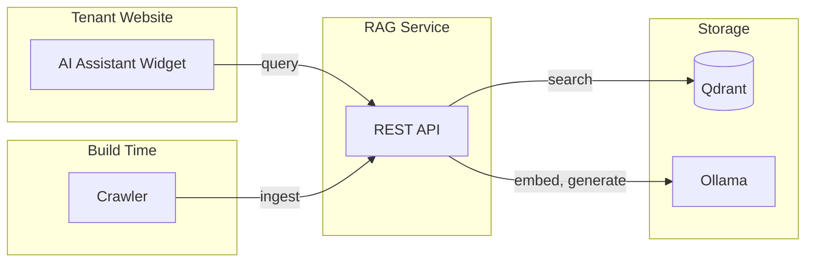
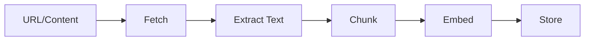
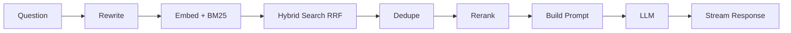

# Architecture

## Overview

Multi-tenant RAG (Retrieval-Augmented Generation) service. Each tenant gets isolated documents, vectors, and configuration—essentially their own AI assistant powered by their documentation.


```mermaid
graph LR
    subgraph "Tenant Website"
        A[AI Assistant Widget]
    end

    subgraph "Build Time"
        B[Crawler]
    end

    subgraph "RAG Service"
        C[REST API]
    end

    subgraph Storage
        D[(Qdrant)]
        E[Ollama]
    end

    A -->|query| C
    B -->|ingest| C
    C -->|search| D
    C -->|embed, generate| E
```

PostgreSQL stores tenant config and document metadata (URLs, status) but isn't in the main data path.

**How it works:**
1. **Crawler** fetches your documentation site, converts HTML→Markdown, and ingests via REST API
2. **RAG Service** chunks the content, generates embeddings, and stores vectors in Qdrant
3. **AI Assistant Widget** (via Client SDK) queries the service and streams answers to users

**Components:**
| Component | Description |
|-----------|-------------|
| Client SDK | TypeScript SDK with drop-in AI Assistant widget |
| Crawler | Playwright-based, converts HTML→Markdown, ingests docs |
| RAG Service | Go backend for ingestion, retrieval, generation |
| PostgreSQL | Tenant and document metadata |
| Qdrant | Vector storage and similarity search |
| Ollama | Local LLM for embeddings and generation |

## Core Components

### 1. Tenant Management

Tenants are isolated knowledge bases. Each has its own API key, system prompt, chunking config, and retrieval params (top_k, min_score).

```go
type Tenant struct {
    ID           string
    Name         string
    APIKey       string
    SystemPrompt string
    Config       TenantConfig  // chunking, retrieval settings
}
```

### 2. Ingestion Pipeline

Documents flow through a multi-stage pipeline:


```mermaid
graph LR
    A[URL/Content] --> B[Fetch] --> C[Extract Text] --> D[Chunk] --> E[Embed] --> F[Store]
```

Chunking strategies:
- `semantic` (default) - markdown-aware, keeps code blocks intact
- `sentence` - groups sentences to target size
- `fixed` - simple word-count splits

The semantic chunker prepends section headers to chunks so retrieval has context. Code blocks and tables are never split.

### 3. Query Engine (ragcore)


```mermaid
graph LR
    A[Question] --> R[Rewrite] --> B[Embed + BM25] --> C[Hybrid Search RRF] --> D[Dedupe] --> RR[Rerank] --> E[Build Prompt] --> F[LLM] --> G[Stream Response]
```

The tenant-agnostic engine lives in `server/internal/ragcore` and is addressed
by an opaque namespace (the app layer passes the tenant ID):

1. **Query rewriting** — with conversation history, one LLM call condenses the
   follow-up into a standalone search query ("what about its pricing?" →
   "Acme Cloud pricing"). Falls back to the raw query on any failure.
2. **Hybrid retrieval** — the query is embedded (dense) and BM25-vectorized
   (sparse, FNV-hashed terms; Qdrant applies IDF server-side); both prefetches
   are fused with Reciprocal Rank Fusion. `min_score` applies to the dense
   prefetch only — fused RRF scores are rank-scale, not cosine.
3. **Dedupe** — near-duplicate chunks removed by Jaccard similarity.
4. **Rerank** (per-tenant flag) — listwise LLM rerank of the candidates.
5. **Generate** — prompt assembled from system prompt + situating context +
   chunks + original question, streamed from the LLM.

**Contextual retrieval** (per-tenant flag): at ingestion, an LLM writes 1-2
situating sentences per chunk, which are embedded (dense and sparse) with the
chunk. Slower ingestion, better retrieval for out-of-context chunks.

### 4. Streaming

Server-Sent Events (SSE) for real-time responses:
- HTTP endpoint `/v1/query/stream`
- Tokens streamed as `data: {"token": "..."}` events
- AI Assistant widget renders incrementally with full Markdown support

## Data Flow

### Document Ingestion

```
1. Crawler fetches page (Playwright for JS rendering)
2. HTML → Markdown conversion (preserves structure)
3. Semantic chunking with header context
4. Each chunk embedded via Ollama (nomic-embed-text)
5. Vectors stored in Qdrant (tenant-isolated collection)
6. Metadata stored in PostgreSQL
```

### Query

```
1. User asks question via AI Assistant widget
2. Question embedded via Ollama
3. Qdrant similarity search within tenant's collection
4. Top chunks retrieved, filtered by min_score
5. Prompt assembled: system_prompt + chunks + question
6. Ollama generates response (llama3.2)
7. Tokens streamed back via SSE, rendered as Markdown
```

## Multi-Tenancy

Each tenant is a single RAG instance (1 tenant = 1 AI assistant). To have multiple AI assistants, create multiple tenants.

Isolation happens at every layer:
- **API**: requests authenticated by tenant API key
- **Vectors**: each tenant gets its own Qdrant collection
- **Metadata**: tenant_id FK on all Postgres tables
- **Config**: per-tenant system prompts, chunking, retrieval settings

## Authentication

Every request carries an `X-API-Key` header (forwarded by the HTTP gateway
into gRPC metadata). Two kinds of keys:

- **Tenant keys** (`rag_...`): identify *and* scope the caller. The server
  derives the tenant from the key — requests carry no tenant ID, so
  cross-tenant access is impossible by construction. Keys are stored as
  SHA-256 hashes (plus a display prefix); the full key is returned exactly
  once, at tenant creation or key regeneration.
- **Admin key** (`ADMIN_API_KEY` env): required for tenant management
  (create/list/delete/regenerate). Tenants may read and update only
  themselves with their own key.

Data access is tenant-scoped at every layer: the auth context in the service
layer, tenant predicates in SQL (including `document_chunks.tenant_id`), and
one Qdrant collection per tenant. A document belonging to another tenant is
indistinguishable from a missing one (404, no existence oracle).

**API key in the browser** is an accepted JAMstack trade-off (same as
Algolia/Firebase); CORS restricts browser callers to configured origins, and
wildcard CORS never allows credentials.

## Tech Stack

| Component | Technology | Purpose |
|-----------|------------|---------|
| Backend | Go | Single binary, good performance |
| Vector DB | Qdrant | Hybrid dense+sparse search, RRF fusion |
| Metadata | PostgreSQL | Tenant/document storage |
| LLM | Ollama or OpenAI-compatible (llama.cpp, vLLM) | Local inference |
| Embeddings | nomic-embed-text | Fast, quality embeddings for docs |
| Client | TypeScript | SDK + AI Assistant widget |
| Crawler | Playwright | JS rendering, HTML→Markdown |

## Configuration

Key environment variables:

```bash
# Server
HTTP_PORT=8080
GRPC_PORT=9090

# Storage
DATABASE_URL=postgres://...
QDRANT_URL=http://localhost:6333

# LLM provider: "ollama" or "openai" (llama.cpp llama-server, vLLM, ...)
LLM_PROVIDER=ollama
# OLLAMA_URL=http://localhost:11434
# LLM_BASE_URL=http://localhost:8081/v1        # provider=openai (generation)
# EMBEDDING_BASE_URL=http://localhost:8082/v1  # provider=openai (embeddings)
OLLAMA_EMBEDDING_MODEL=nomic-embed-text
OLLAMA_LLM_MODEL=llama3.2

# Auth
ADMIN_API_KEY=...
CORS_ALLOWED_ORIGINS=https://your-site.example

# Pipeline
QUERY_REWRITE_ENABLED=true
DEFAULT_HYBRID_ENABLED=true
DEFAULT_RERANKER_ENABLED=false
DEFAULT_CONTEXTUAL_RETRIEVAL=false

# Defaults
DEFAULT_CHUNK_METHOD=semantic
DEFAULT_TOP_K=4
DEFAULT_MIN_SCORE=0.35
```

## Migrating pre-hybrid tenants

Tenants created before hybrid search have dense-only Qdrant collections.
`server/cmd/ragreindex` rebuilds a tenant's collection as hybrid from the
chunks in Postgres (no re-crawl) and enables the flag:

```bash
cd server && go run ./cmd/ragreindex --tenant <uuid>   # or --all
# add --contextual to also backfill situating context (slow)
```
